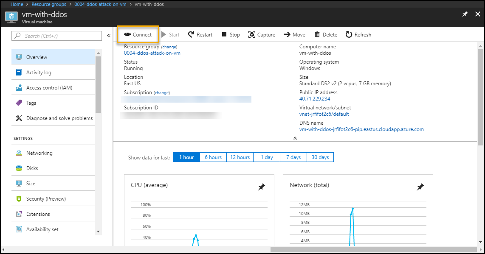
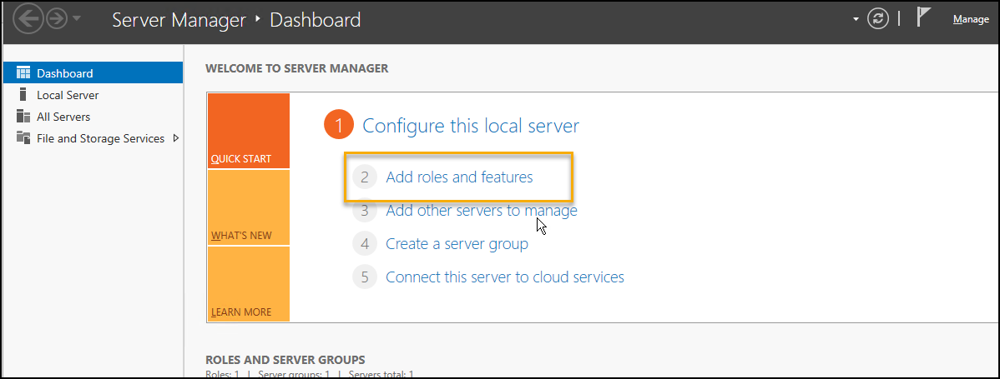
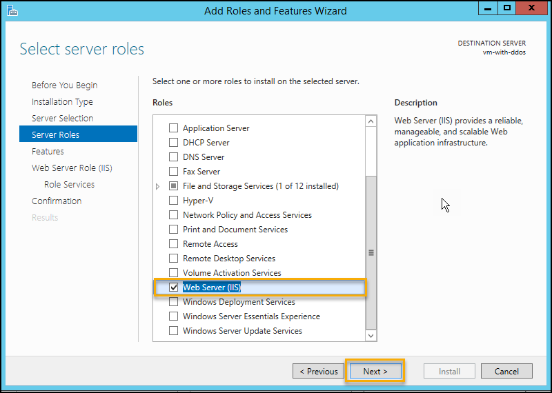
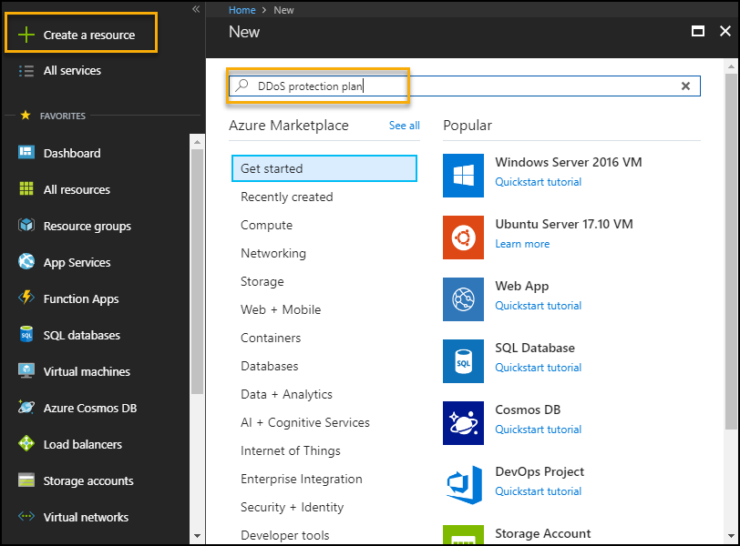
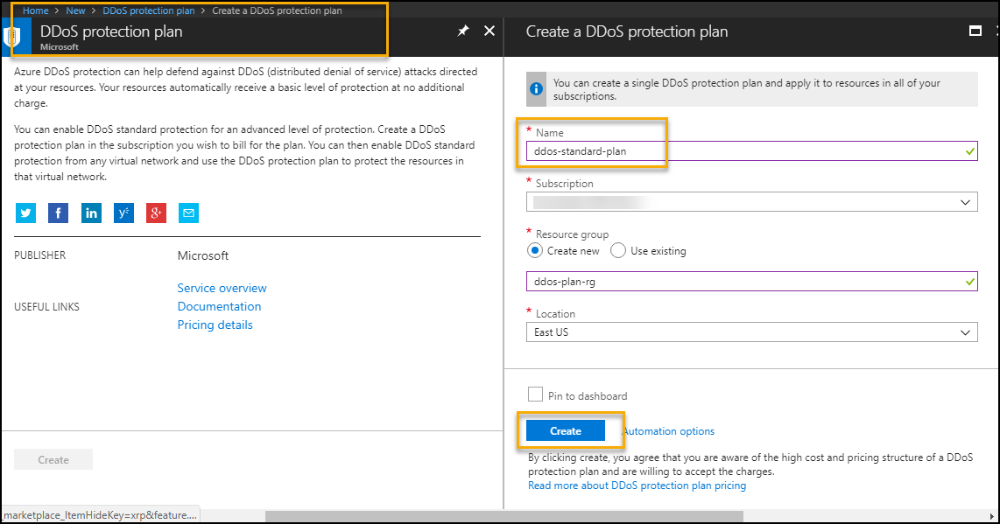
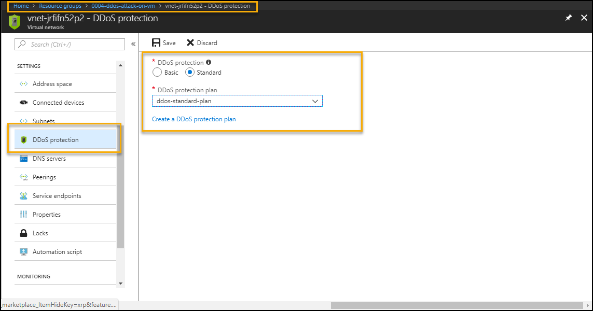
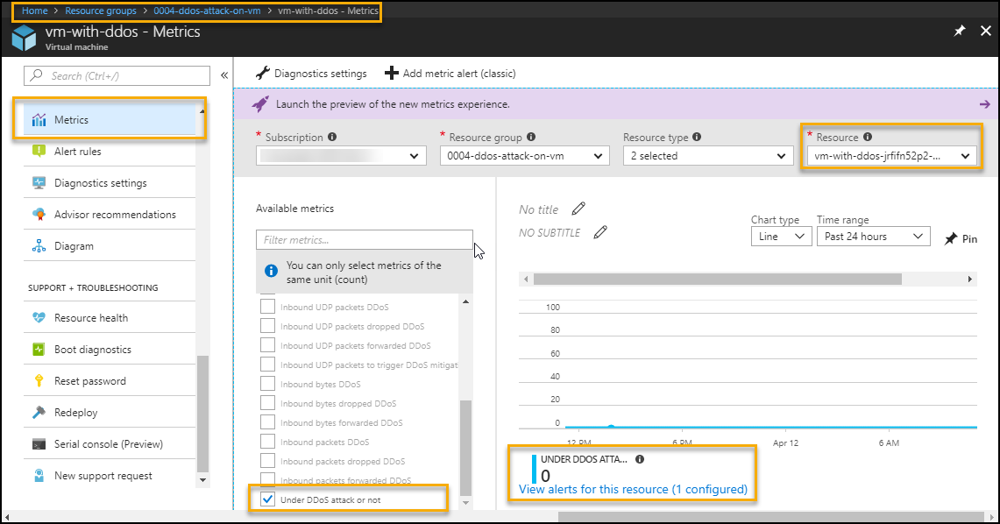
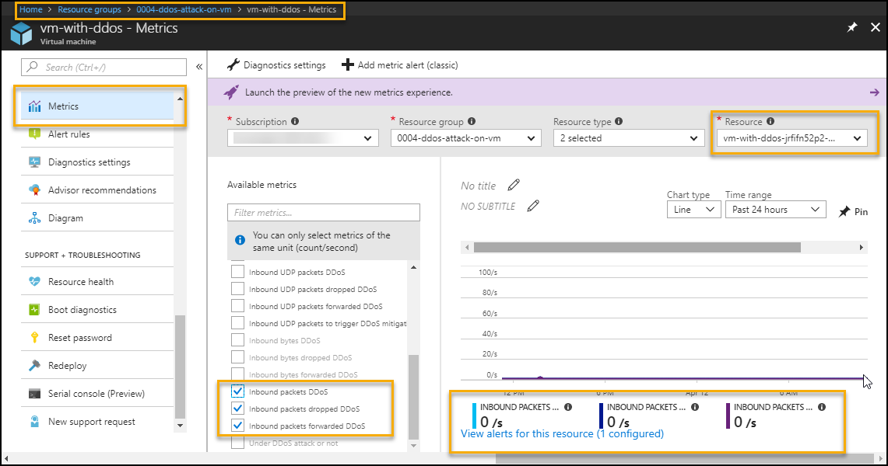
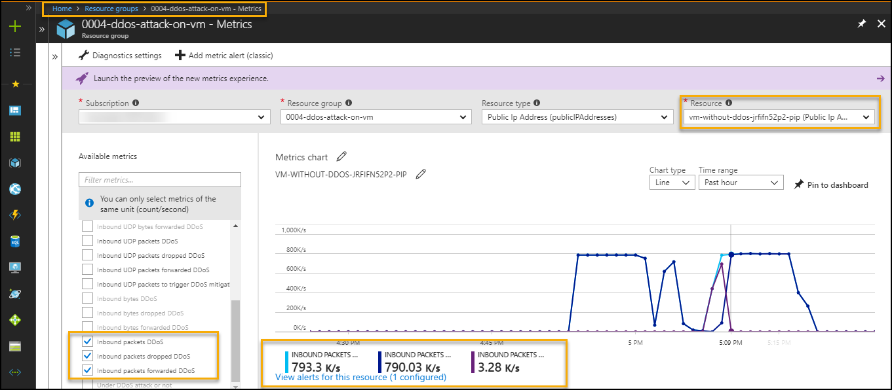
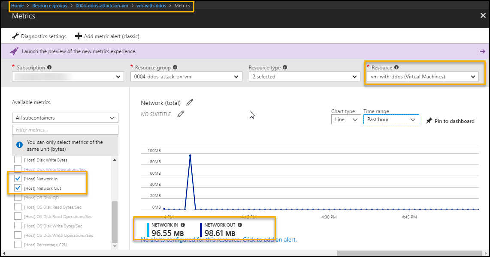

# DDoS Protection attack on a Virtual Machine Scenario 
This repository contains DDoS attack detection & prevention on a Virtual Machine 

# Table of Contents
1. [Objectives](#objectives)
2. [Overview](#overview)
3. [Pre-requisites](#prerequisites)
4. [Deploy](#deploy)
5. [Perform Attack](#attack)
6. [Detect and Mitigate Attack](#detect)
7. [References](#references)
8. [Configuration validation](#config)

# Objective of the POC  
Showcase DDoS Protection Standard on Azure resources with public IP

# Overview
It showcases following use cases
1. Perform DDoS attack on resources in a virtual network including public IP addresses associated with virtual machines by following configuration --> DDoS Protection Standard detects attack and mitigate the DDoS attack and send alert.
    * Virtual Network (VNet enabled DDoS Protection Standard)

# Important Notes
DDoS Protection Standard protects resources in a virtual network including public IP addresses associated with virtual machines, load balancers, and application gateways. When coupled with the Application Gateway web application firewall, DDoS Protection Standard can provide full layer 3 to layer 7 mitigation capability.  
Refer [Azure DDoS Protection Standard](https://docs.microsoft.com/en-us/azure/virtual-network/ddos-protection-overview) for more details.

# Prerequisites
Access to Azure subscription to deploy following resources

1.  Virtual Machine with Virtual Network
2.  OMS (Monitoring)

# Deploy 
1. Deploy using "Deploy to Azure" button at the top 

Following steps are required to create email alert by metric level

1. Clone Azure quickstart templates repository using

    `git clone https://github.com/Azure/azure-quickstart-templates.git`

3. Open Windows PowerShell (Run as Administrator) and navigate to 101-DDoS-Attack-Prevention directory 
 
    `cd .\azure-quickstart-templates\101-DDoS-Attack-Prevention\`
3. Login to Azure by passing subscription id to execute script.

    `Login-AzureRmAccount -SubscriptionId "<subscription id>" `
4. Execute following command to create email alert rule

    `.\DSC\configure-metricrule.ps1 -ResourceGroupName "<ResourceGroupName>" -Location "<location>" -Email "<EmailID>" -Verbose`
    
5.  To manually configure IIS server on VM follow below steps  
    a. Go to Azure Portal --> Select Resource Groups services --> Select Resource Group - <ResourceGroupName> given during deployment  
    b. Select VM with name 'vm-with-ddos'

    

    c. On Properties Page --> Click Connect to Download RDP file --> Save and Open RDP file.

    

    d. Enter login details (The VM login username and password is in deployment powershell output)
    
    e. Open Server Manager and install Web Server (IIS).

    

    
               
    
6. To configure Azure Security Center, pass email address `<email id>` for notification

    `.\DSC\configure-azuresecuritycenter.ps1 -EmailAddressForAlerts <email id>`

7.  To create standard DDoS plan and configure with virtual network  

    a. Go to Azure Portal --> Click on "Create a resource" --> Search "DDoS Protection  plan"

      
    
    b. Enter details 

      

    c. Configure standard DDoS protection plan on VNet

      

# Perform Attack 
 ### * Attack VM without DDoS protection & analyze  
Microsoft have partnered with [BreakingPoint Cloud](https://www.ixiacom.com/products/breakingpoint-cloud) to offer tooling for Azure customers to generate traffic load against DDoS Protection enabled public endpoints to simulate TCP SYN flood and DNS flood attack on the VM without DDoS Protection Standard. Create a  support request with [BreakingPoint Cloud](https://www.ixiacom.com/products/breakingpoint-cloud) for simulation of a DDoS attack on infrastructure. The team executed TCP SYN flood and DNS flood attack on the VM without DDoS Protection Standard   

In this case DDoS attack can not be detected as shown in below images.  
To monitor from metrics to find public IP is under DDoS attack (Does not detect DDoS attack)   
    Azure Portal-->Resource Group --> VM --> Metrics --> Select below options   
    - Select specific Public IP in resource option    
    - "Under DDoS attack or not" in metrics filter   
    

   

To monitor from metrics to find public IP inbound packets status (Does not detect DDoS attack)  
    Azure Portal-->Resource Group --> VM --> Metrics --> Select below options from metrics filter   
    - inbound packets DDoS   
    - inbound packets dropped DDoS   
    - inbound packets forwarded DDoS   

  

 ### * Attack on VM with DDoS Protection Standard  

Microsoft have partnered with [BreakingPoint Cloud](https://www.ixiacom.com/products/breakingpoint-cloud) to offer tooling for Azure customers to generate traffic load against DDoS Protection enabled public endpoints to simulate TCP SYN flood and DNS flood attack on the VM without DDoS Protection Standard. Create a  support request with [BreakingPoint Cloud](https://www.ixiacom.com/products/breakingpoint-cloud) for simulation of a DDoS attack on infrastructure. The team executed TCP SYN flood and DNS flood attack on the VM with DDoS Protection Standard  

# Detect and mitigate attack
The DDoS attack on VM with DDoS Protection Standard is detected and mitigated as shown in below images.  
To monitor from metrics to find public IP is under DDoS attack (Detect DDoS attack)   
    Azure Portal-->Resource Group --> VM --> Metrics --> Select below options   
    - Select specific Public IP in resource option    
    - "Under DDoS attack or not" in metrics filter   
 

   

To monitor from metrics to find public IP inbound packets status (Detect DDoS attack)  
    Azure Portal-->Resource Group --> VM --> Metrics --> Select below options from metrics filter   
    - inbound packets DDoS   
    - inbound packets dropped DDoS   
    - inbound packets forwarded DDoS   

  
   

The DDoS Protection Standard detects and mitigates the attack on VM. The below image of network metrics of VM while network in attack.  
To monitor network in and network out follow below steps  
    Azure Portal-->Resource Group --> VM --> Metrics --> Select VM name in resource --> select netork in / out in metrics filter

   
    

The email alert configured at metrics level, This will send the alert mail if VNet is under DDoS attack over last the 5 minutes  
  ( Note: Deployment UserName is used to get the email alert for DDoS attack )
  
    
   

## Configuration Validation
* Distributed denial of service (DDoS) attacks are some of the largest availability and security concerns facing customers that are moving their applications to the cloud. A DDoS attack attempts to exhaust an application’s resources, making the application unavailable to legitimate users. Azure DDoS protection, combined with application design best practices, provide defense against DDoS attacks. Automatic detection and remediation procedure of such vulnerabilities can be easily done using the controls available in Cloudneeti.

* Cloudneeti is available on the Azure marketplace. Try out the free test drive here https://aka.ms/Cloudneeti 

**References** 

1.	 DDoS Blog: http://aka.ms/ddosblog
2.	DDoS Protection overview: http://aka.ms/ddosprotectiondocs
3.	DDoS Standard best practices & reference architecture : http://aka.ms/ddosbest 